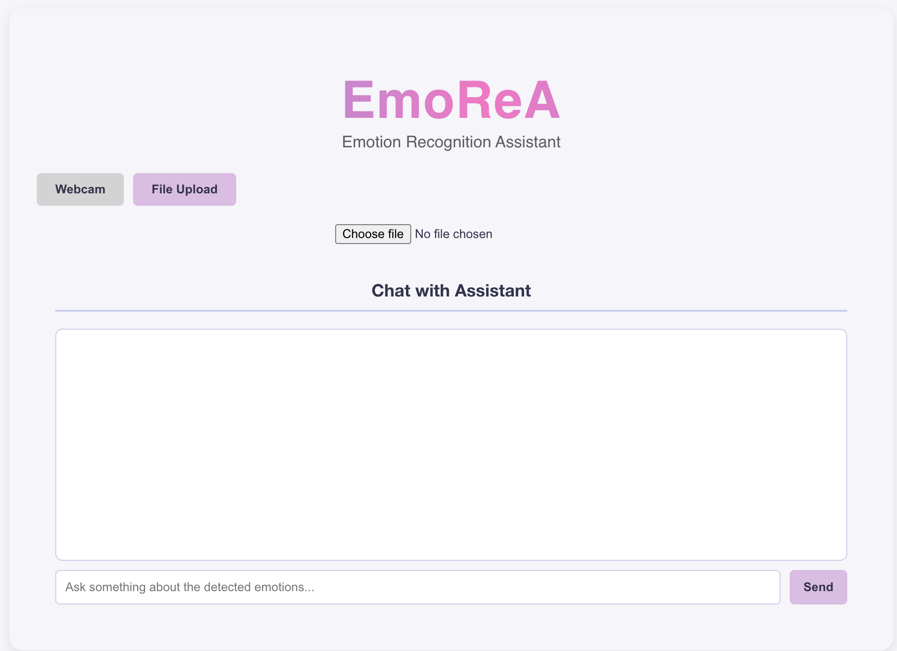
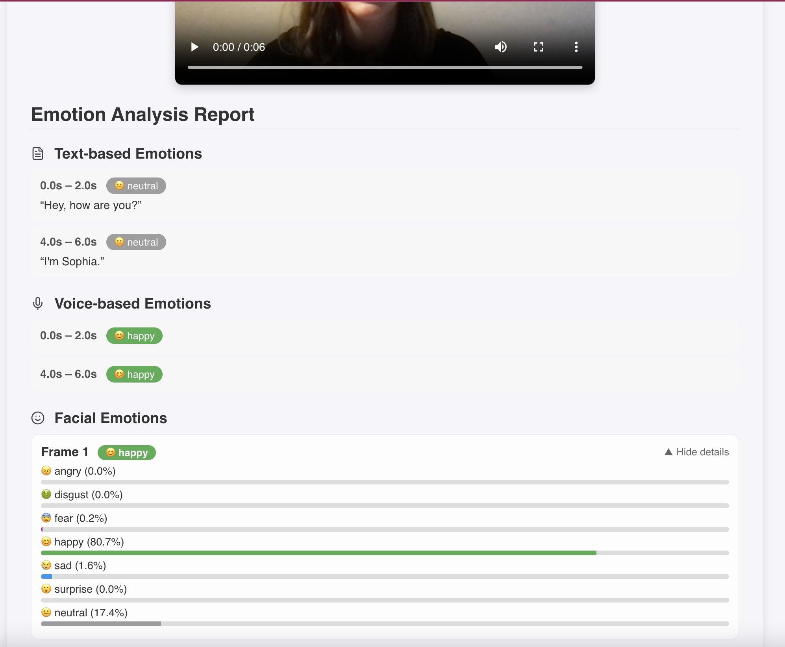
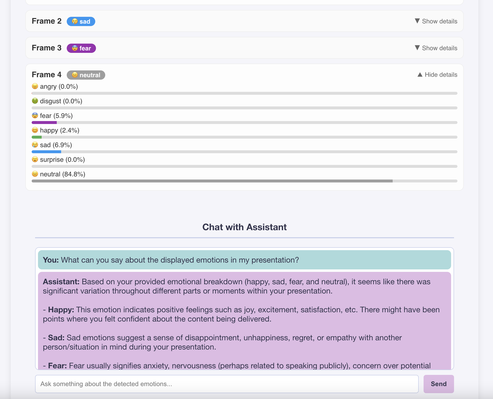

# EmoReA: Emotion Recognition Assistant

[](LICENSE)


> **Code developed for the Master's Thesis:**  
> **_Emotion Recognition in Multimedia Content_**  
> Master’s in Computer Science and Multimedia at Lisbon School of Engineering (ISEL), 2025  


EmoReA is an Emotion Recognition Assistant designed for multimodal emotion analysis. It integrates a user-friendly web interface (React frontend) with a Python backend API to process and understand emotions from various data types like text, audio, image, and video.

## Sub-Repositories

-   **`emorea-frontend/`**: Contains the React-based frontend application for user interaction and visualization. [Link to frontend README](emorea-frontend/README.md)
-   **`emorea-backend/`**: Contains the FastAPI backend API responsible for data processing, emotion analysis, and the chatbot functionality. [Link to backend README](emorea-backend/README.md)

## Installation

To get started with EmoReA, you'll need to install the dependencies for both the frontend and backend. Please follow the detailed instructions provided in the README files of each sub-repository:

-   [Frontend Installation](emorea-frontend/README.md#installation)
-   [Backend Installation](emorea-backend/README.md#installation)

## Running the Application

Instructions for running the frontend and backend development servers are provided in their respective README files:

-   [Running the Frontend](emorea-frontend/README.md#running-the-frontend)
-   [Running the Backend](emorea-backend/README.md#running-the-backend)


### Main Interface


### Emotion Analysis Result


### Chat About Results


## Deployment

### Local Deployment

To run EmoReA on your local machine for development or testing:

1.  **Backend:** Navigate to the `emorea-backend` directory and follow the instructions in its README to install dependencies and run the FastAPI development server (typically using Uvicorn). This will usually run on `http://localhost:8000`.

2.  **Frontend:** Open a new terminal, navigate to the `emorea-frontend` directory, and follow the instructions in its README to install dependencies and start the React development server (usually using `npm start` or `yarn start`). This will typically run on `http://localhost:3000`. The frontend is configured to communicate with the backend at `http://localhost:8000`.

### Google Cloud Platform (GCP) Deployment

Deploying EmoReA to GCP involves containerizing the application (using Docker) and then deploying it using a suitable GCP service. Here's a high-level overview:

1.  **Containerization (Docker):**
    -   Create a `Dockerfile` for your backend in the `emorea-backend` directory. This file will define the environment and steps to build a Docker image for your FastAPI application.
    -   Create a `Dockerfile` for your frontend in the `emorea-frontend` directory. This will define how to build and serve your React application (e.g., using Nginx or a Node.js production server like `serve`).
    -   Build the Docker images for both the backend and frontend.
    -   Push these images to a container registry like Google Container Registry (GCR).

2.  **GCP Service Selection:**
    -   **Backend:** Consider using **Google Cloud Run**. It's a fully managed serverless platform that allows you to run stateless containers. It's cost-effective and scales automatically.
    -   **Frontend:** You can also deploy the frontend container to **Google Cloud Run** or use **Firebase Hosting** or **Cloud Storage with Cloud CDN** for serving static websites, depending on your frontend's build output.

3.  **Deployment Configuration:**
    -   **Cloud Run (Backend):** Configure a Cloud Run service with the backend Docker image from GCR. Set environment variables (if needed), configure scaling options, and expose the backend port (e.g., 8080).
    -   **Cloud Run (Frontend) / Firebase Hosting / Cloud Storage:** Configure the deployment of your frontend build artifacts. If using Cloud Run, ensure it's configured to serve the static content.

4.  **API Endpoint and CORS:**
    -   Ensure your frontend is configured to communicate with the deployed backend API endpoint (the Cloud Run URL).
    -   Update the CORS settings in your backend (`emorea-backend/main.py`) to allow requests from your deployed frontend URL.

5.  **CI/CD (Optional but Recommended):**
    -   Set up a CI/CD pipeline (e.g., using GitHub Actions and Google Cloud Build) to automate the process of building, testing, and deploying your application whenever you push changes to your repository.

## Contributing

We appreciate all contributions! Feel free to open an issue or submit a pull request to suggest improvements. All contributors will be formally acknowledged and highlighted in this section.

## License

This project is licensed under the [MIT License](LICENSE) - see the [LICENSE](LICENSE) file for details.

## Citation

If you use this project, code, or findings in your research, please cite the corresponding publication(s) below:

### 1. Master's Thesis
> Condesso, S. F. (2025). *Emotion recognition in multimedia content* (Master's thesis, Instituto Superior de Engenharia de Lisboa). Repositório Institucional do IPL. http://handle.net

```bibtex
@mastersthesis{thesis2025emotion,
  author       = {Condesso, Sofia Fernandes and Ferreira, Artur Jorge and Leite, Nuno Miguel da Costa de Sousa},
  title        = {Emotion recognition in multimedia content},
  school       = {Instituto Superior de Engenharia de Lisboa},
  year         = {2025},
  type         = {Master's thesis},
  url          = {http://handle.net}
}
```

### 2. Conference Papers

#### Facial Emotion Recognition (2026)
> Condesso, S., Ferreira, A. J., & Leite, N. (2026). Facial Emotion Recognition: A Comparative Study with Cross-Corpus and Multi-Corpus Training. In *Proceedings of the Conference*.

```bibtex
@inproceedings{inproceedings,
author = {Condesso, Sofia and Ferreira, Artur and Leite, Nuno},
year = {2026},
month = {03},
pages = {},
title = {Facial Emotion Recognition: A Comparative Study with Cross-Corpus and Multi-Corpus Training},
doi = {10.5220/0014639300004067}
}
```

#### User Emotion Recognition (2025)
> Condesso, S., Ferreira, A. J., & Leite, N. (2025). User Emotion Recognition from Speech and Text Messages with Machine Learning Techniques. In *Proceedings of the Conference*.

```bibtex
@inproceedings{inproceedings,
author = {Condesso, Sofia and Ferreira, Artur and Leite, Nuno},
year = {2025},
month = {10},
pages = {},
title = {User Emotion Recognition from Speech and Text Messages with Machine Learning Techniques}
}
```